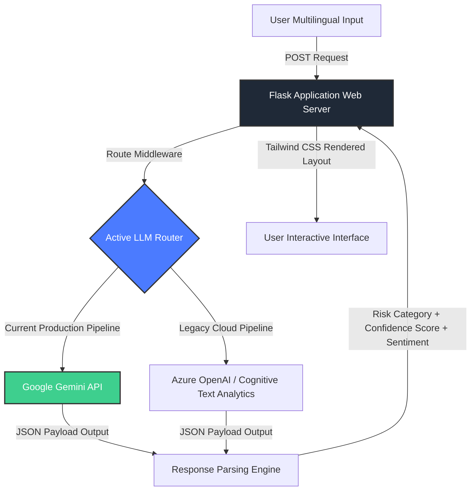

# 🤖 Chatbot AI: Detecting Scams, Hoaxes & Gambling Promotions (Multi-LLM Integration)

[](https://www.linkedin.com/in/wira-dhana-putra/)
[](https://medium.com/@wiradp)
[](https://wiradp.github.io/)

An intelligent web application and NLP pipeline engineered to detect cyber threats, misleading hoaxes, and illegal gambling promotions in text messages. This system combines a responsive web frontend with cloud-hosted Large Language Models (LLMs) to deliver real-time risk assessment, sentiment analysis, and structural indicators.

---

## 🌍 Live Demo & Architecture Transition

You can explore the live application and its architecture variants here:

*   🔗 **Current Active Version (Google Gemini API Integration)**: [wiradp.github.io/chatbot-ai/](https://wiradp.github.io/chatbot-ai/)  
    *Integrated with Gemini API via client-side execution for public access scaling and serverless deployment.*
*   🔗 **Legacy Deployment (Microsoft Azure OpenAI)**: `https://cekfakta-ai-app.azurewebsites.net`  
    *(Note: This endpoint utilized Azure Cognitive Services during the initial deployment phase. The Azure free trial subscription has concluded, disabling the legacy cloud host).*

---

## 📌 Project Overview & Context

Digital communication platforms are heavily plagued by malicious content—ranging from financial phishing scams (SMS/WhatsApp spam) and calculated disinformation (hoaxes) to aggressive gambling promotions. Non-technical users frequently fall into these traps due to the absence of immediate, plain-language verification tools.

This project addresses this risk by building a fast web agent. Users can input any suspicious multilingual string (supports Indonesian, English, Arabic, etc.), and the underlying engine calculates the **threat classification**, **confidence level**, **sentiment analysis**, and yields an automated **human-readable explanation** detailing *why* the text poses a hazard.

---

## 🏗️ System Architecture & Data Flow

The system orchestrates data from user submission, through localized layout styling, into external secure cloud LLM gateways. (Note: The flowchart below reflects the full-stack architecture optimized for local development and backend deployment).



---

## 🚀 Core Features

* 🧠 **Advanced Multi-Label Classification:** Simultaneously isolates scams, hoaxes, and gambling campaigns within a single analysis phase.
* 🌐 **Multilingual Verification:** Capable of breaking down linguistic tokens across languages (Indonesian slangs, English, Arabic).
* 📊 **Granular Metrics Output:** Returns categorical confidence levels, safety alerts, and underlying textual sentiment analysis.
* ⚡ **Optimized UI Execution:** Engineered using Flask micro-framework and Tailwind CSS for rapid mobile-responsive browser rendering.

---

## 🗂️ Project Structure

```text
chatbot-ai-azure/
├── app.py                 # Application core entry point & Flask routing
├── requirements.txt       # Environment dependency manifest
├── .env                   # Local cryptographic keys & API endpoints credentials
├── config/
│   └── azure_config.py    # Legacy cloud credential mapping
├── services/
│   └── ai_service.py      # LLM API orchestration & parsing abstraction layer
├── templates/
│   └── index.html         # Frontend Document Object Model (DOM) layout
└── static/
    ├── js/
    │   └── script.js      # Asynchronous DOM event handlers
    └── css/
        └── input.css      # Tailwinds CSS compilation source

```

---

## 🛠️ Tech Stack & Tools

* **Backend Framework:** Python 3.8+, Flask Micro-framework
* **Frontend Design:** Tailwind CSS, JavaScript (Asynchronous Fetch API)
* **AI Orchestration:** Google Gemini API *(Current)*, Azure OpenAI & Azure Text Analytics *(Legacy)*
* **Development Platform:** Linux (Zorin OS)

---

## ⚙️ Local Development & Installation

Follow these steps to replicate the core classification service on your machine:

```bash
# 1. Clone this repository
git clone https://github.com/wiradp/chatbot-ai-azure.git
cd chatbot-ai-azure

# 2. Configure environment parameters
# Create a .env file in the root directory and append your specific API keys:
# GEMINI_API_KEY=your_secret_gemini_key

# 3. Build virtual environment and install runtime requirements
python -m venv venv
source venv/bin/activate  # On Windows use `venv\Scripts\activate`
pip install -r requirements.txt

# 4. Initiate local development engine
python app.py
```

Once running, navigate to `http://localhost:5000` inside your preferred web browser 🚀.

---

## 📬 Connect with Me

If you want to discuss Multi-LLM architectures, text parsing strategies, or data safety implementations, let's collaborate!

* **LinkedIn:** [wira-dhana-putra](https://www.linkedin.com/in/wira-dhana-putra/)
* **Medium Articles:** [@wiradp](https://medium.com/@wiradp)
* **Portfolio Website:** [wiradp.github.io](https://wiradp.github.io/)
* **GitHub Profile:** [@wiradp](https://github.com/wiradp)

---